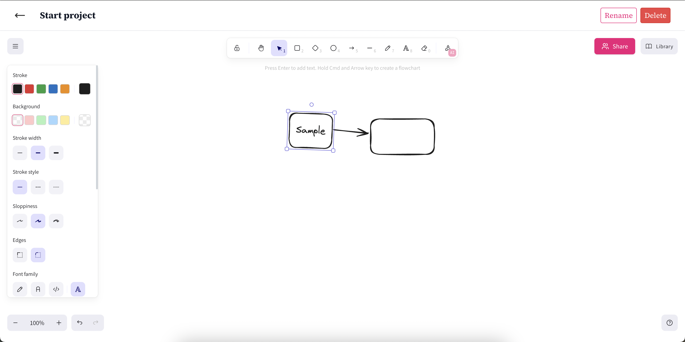
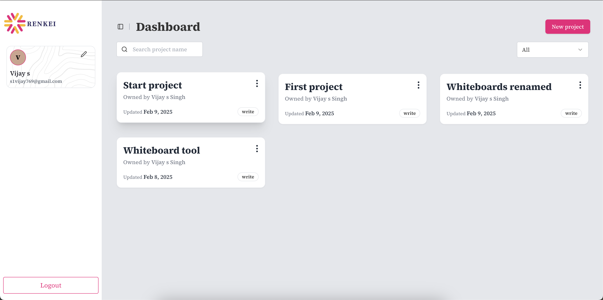

# Renkei
[Visit site](https://renkei-latest.onrender.com/)


---

---



Renkei is a collaborative whiteboard app frontend built with **Next.js (v15)**. It leverages **Tailwind CSS** for styling, **Radix UI** for accessible components, and **Socket.io** for real-time updates.
A curious fact *renkei* means *co-operation* in Japanese. 🇯🇵

---

## Table of Contents

- [Overview](#overview)
- [Tech Stack](#tech-stack)
- [Prerequisites](#prerequisites)
- [Environment Variables](#environment-variables)
- [Setup & Installation](#setup--installation)
- [Usage](#usage)
- [Contributing](#contributing)
- [License](#license)

---

## Overview

The Renkei frontend provides an interactive whiteboard experience with real-time collaboration. It integrates seamlessly with the backend via API calls and Socket.io channels.

---

## Tech Stack

- **Next.js (v15)**: React framework for SSR and SSG
- **Tailwind CSS**: Utility-first CSS framework
- **Radix UI**: Unstyled, accessible UI components
- **Socket.io**: Real-time communication library
- **JavaScript**: Core programming language
- **Docker**: Used to create build images and deploy to render using github CI/CD with actions

---

## Prerequisites

Before running the frontend, ensure you have installed:

- Node.js (v18+ recommended)
- NPM (or Yarn)
- Generate `localhost-key.pem` and `localhost.pem` for https on local and store at the same level at the project in `cert` folder

---

## Environment Variables

This project does not use any ENV_VARS or any .env file.
The only variable used in backend URL
```javascript
API_DOMAIN = https://localhost:8080
```
This variable is store in api.js file.

---

## Setup & Installation

### Clone the Repository

```bash
git clone https://github.com/HitendraSinghRathore/renkei.git
cd renkei
```

### Install dependencies

```bash
npm install
```
### Run project

```bash
npm run dev
```

---

## Usage

Once setup on local you can login using the `3000` port (default for next js)

```javascript
https://localhost:3000
```

---
## Contributing

Contributions are welcome! Please fork the repository and submit pull requests. For major changes, please open an issue first to discuss what you would like to change.

---

## License

This project is licensed under the [MIT License](https://mit-license.org/)


