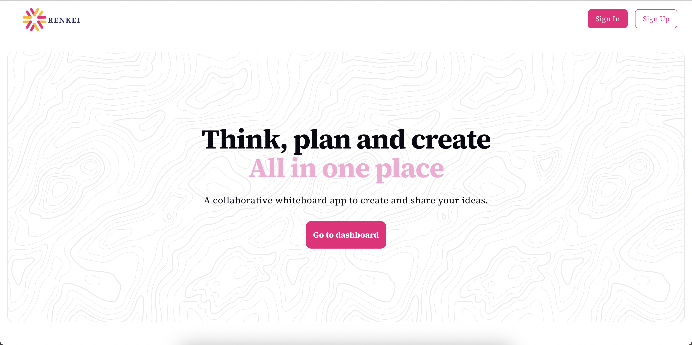

# Renkei
[Visit site](https://renkei-latest.onrender.com/)




Renkei is a collaborative whiteboard app frontend built with **Next.js (v15)**. It leverages **Tailwind CSS** for styling, **Radix UI** for accessible components, and **Socket.io** for real-time updates.

---

## Table of Contents

- [Overview](#overview)
- [Tech Stack](#tech-stack)
- [Prerequisites](#prerequisites)
- [Environment Variables](#environment-variables)
- [Setup & Installation](#setup--installation)
- [Usage](#usage)
- [Contributing](#contributing)
- [License](#license)

---

## Overview

The Renkei frontend provides an interactive whiteboard experience with real-time collaboration. It integrates seamlessly with the backend via API calls and Socket.io channels.

---

## Tech Stack

- **Next.js (v15)**: React framework for SSR and SSG
- **Tailwind CSS**: Utility-first CSS framework
- **Radix UI**: Unstyled, accessible UI components
- **Socket.io**: Real-time communication library
- **JavaScript**: Core programming language

---

## Prerequisites

Before running the frontend, ensure you have installed:

- Node.js (v14+ recommended)
- NPM (or Yarn)

---

## Environment Variables

This project does not use any ENV_VARS or any .env file.
The only variable used in backend URL
```javascript
API_DOMAIN = https://localhost:8080
```
This variable is store in api.js file.

---

### Setup & Installation


